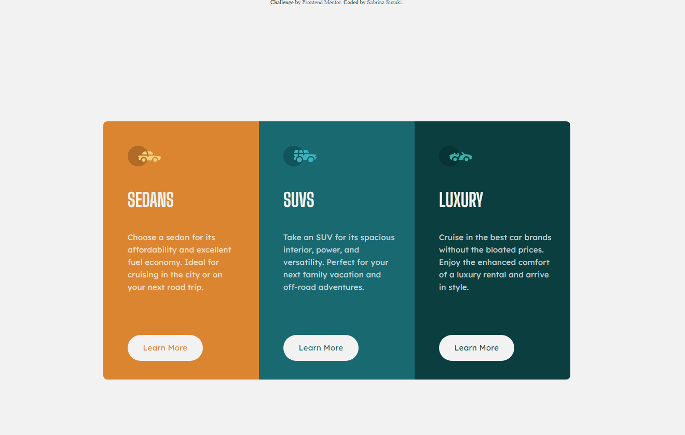

# README

<a href="https://www.frontendmentor.io/challenges/3column-preview-card-component-pH92eAR2-">Link do desafio do projeto</a>

<a href="https://3-column-preview-card-desafio-frontendmentor.netlify.app" target= "_blank" >Ver o projeto</a>

Ainda preciso deixar responsivo.

👽Sabrina Suzuki

